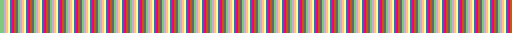
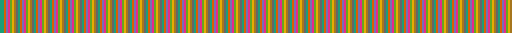
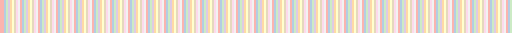
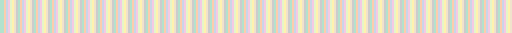
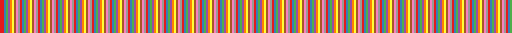
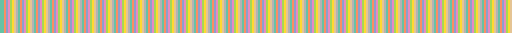
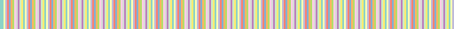
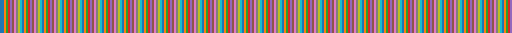
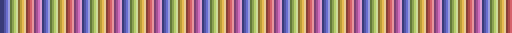

# colormat
Custom colormap functionality in MATLAB

## Data Sources
- Seaborn [tutorial](https://seaborn.pydata.org/tutorial/color_palettes.html) and [data](https://github.com/mwaskom/seaborn/blob/7001ebe72423238e99c0434a2ef0a0ebc9cb55c1/seaborn/cm.py)
- crameri [site](https://www.fabiocrameri.ch/colourmaps/) and [repo with data](https://github.com/chadagreene/crameri) 
- matplotlib by Stephen23 [on MATLAB FileExchange](https://au.mathworks.com/matlabcentral/fileexchange/62729-matplotlib-perceptually-uniform-colormaps) - used under BSD License and CC0
- ColorBrewer [site](https://colorbrewer2.org/) and [data](https://github.com/scottclowe/cbrewer2/tree/master/cbrewer2) - used under Apache License 2.0
- `bwr`, `coolwarm`, `seismic` generated manually using data from the [matplotlib repo](https://github.com/matplotlib/matplotlib/blob/main/lib/matplotlib/_cm.py)

## Usage
- There are several kinds of colormaps included:
  - Sequential
  - Diverging
  - Qualitative
  - Cyclic
  - Multisequential (only in crameri) - not yet implemented
- The maps have been implemented as functions that return an Nx3 array of RGB values in the range 0-1.
- The maps can be used directly in MATLAB with the `colormap` function. For example: `colormap('viridis');` or `colormap(viridis);`
- All the maps can be called with an optional first argument to specify the number of colors. For example: `colormap(viridis(100));`.
  - The sequential/cyclic/diverging maps can be requested with any number of colors, and will be linearly interpolated as necessary.
  - The qualitative maps have a maximum number of colors that can be requested. If a larger number is requested, the colours will cycle.

### Cyclic Maps  
- The cyclic maps can be called with a second optional argument (in the interval `[0,1)`) to specify what position to start the cycle at. For example: `colormap(twilight(100, 0.5));` will start the cycle halfway through the map.
  - Try `figure; for ii=0:14; imagesc(nexttile, (1:255)/255); colormap(gca(), twilight(100, ii/14)); colorbar('Location', 'southoutside'); end` to see the effect.

### Diverging Maps
- By default, the whole range of colours in the map is returned. The diverging maps are centred on the middle colour (e.g. white in `bwr`/`seismic`, yellow in `spectral`). This is appropriate for data that are symmetrically distributed around a central value. 
  - `figure; colormap(bwr); colorbar` or `figure; colormap('bwr'); colorbar`
- The number of colours `n` in the map can be specified as an optional first argument, as described above.
  - `figure; colormap(bwr(15)); colorbar`
- The distribution of colours can be changed using the `mapname(___,'clims', [cmin cmax])` syntax. The centre point remains at 0, unless this is changed. 
  - `figure; for ii = 0:3; clim(nexttile,[-2.5 -0.5]+ii); colormap(gca(), bwr(256,'clim',gca().CLim)); colorbar; end`
- By default, the centre point is treated as 0, and the limits of the map are at -1 and 1. These can be changed independently. If the data are all positive/negative, only the upper/lower half of the colour range will be used.
- The location of the centre point can be changed using the `mapname(___,'center', center)` syntax. The middle colour will be at the value `center`.
  - `figure; for ii = 0:4; clim(nexttile,[-1 1]); colormap(gca(), bwr(256,'center',-1+ii/2)); colorbar; end`
- The way the colours are trimmed at the limits can be changed using the `mapname(___,'mode', 'complete')` or `mapname(___,'mode', 'trimmed')` syntax. For example, if the data range is `[-1, 2]`, the default 'trimmed' mode will return the utilise only half the colours in the lower half of the colour range. The 'complete' mode will use all the colours in the in the lower half of the colour range, but will be compressed. 
  - `figure; for ii = 0:4; for jj = ["trimmed","complete"]; clim(nexttile,[-1 1]); colormap(gca(), bwr(256,'center',-1+ii/2,'mode',jj)); colorbar; end; end`
- The parameters `n` and `clim` can be automatically detected using the `mapname(___,'Parent', h)` syntax, where `h` is an axes or figure handle. If the handle `h` contains the property `CLim`, this will be used to determine the colour limits. If the handle `h` contains a colormap, this will be used to determine the height of the output. Note that specifying `n` or `clim` directly will override the automatic detection.
- Also note that the `mapname(___,'Parent', h)` syntax does NOT apply the colormap to the axes/figure `h`. It only uses the properties of `h` to determine the output. The colormap must still be applied using the `colormap` function.

## Maps

| Name | Source | Map |
| :--: | :----: | :-: |
| accent | colorbrewer |  |
| acton | crameri |  |
| bam | crameri |  |
| bamako | crameri |  |
| bamo | crameri |  |
| batlow | crameri |  |
| batlowk | crameri |  |
| batloww | crameri |  |
| berlin | crameri |  |
| bilbao | crameri |  |
| blues | colorbrewer |  |
| brbg | colorbrewer |  |
| broc | crameri |  |
| broco | crameri |  |
| buda | crameri |  |
| bugn | colorbrewer |  |
| bupu | colorbrewer |  |
| cividis | matplotlib |  |
| cork | crameri |  |
| corko | crameri |  |
| crest | seaborne |  |
| dark2 | colorbrewer |  |
| davos | crameri |  |
| devon | crameri |  |
| flare | seaborne |  |
| gnbu | colorbrewer |  |
| grayc | crameri |  |
| greens | colorbrewer |  |
| greys | colorbrewer |  |
| hawaii | crameri |  |
| icefire | seaborne |  |
| imola | crameri |  |
| inferno | matplotlib |  |
| lajolla | crameri |  |
| lapaz | crameri |  |
| lisbon | crameri |  |
| magma | matplotlib |  |
| mako | seaborne |  |
| nuuk | crameri |  |
| oranges | colorbrewer |  |
| orrd | colorbrewer |  |
| oslo | crameri |  |
| paired | colorbrewer |  |
| pastel1 | colorbrewer |  |
| pastel2 | colorbrewer |  |
| piyg | colorbrewer |  |
| plasma | matplotlib |  |
| prgn | colorbrewer |  |
| pubu | colorbrewer |  |
| pubugn | colorbrewer |  |
| puor | colorbrewer |  |
| purd | colorbrewer |  |
| purples | colorbrewer |  |
| rdbu | colorbrewer |  |
| rdgy | colorbrewer |  |
| rdpu | colorbrewer |  |
| rdylbu | colorbrewer |  |
| rdylgn | colorbrewer |  |
| reds | colorbrewer |  |
| rocket | seaborne |  |
| roma | crameri |  |
| romao | crameri |  |
| set1 | colorbrewer |  |
| set2 | colorbrewer |  |
| set3 | colorbrewer |  |
| spectral | colorbrewer |  |
| tab10 | matplotlib |  |
| tab20 | matplotlib |  |
| tab20b | matplotlib |  |
| tab20c | matplotlib |  |
| tofino | crameri |  |
| tokyo | crameri |  |
| turku | crameri |  |
| twilight | matplotlib |  |
| twilight_shifted | matplotlib |  |
| vanimo | crameri |  |
| vik | crameri |  |
| viko | crameri |  |
| viridis | matplotlib |  |
| vlag | seaborne |  |
| ylgn | colorbrewer |  |
| ylgnbu | colorbrewer |  |
| ylorbr | colorbrewer |  |
| ylorrd | colorbrewer |  |

